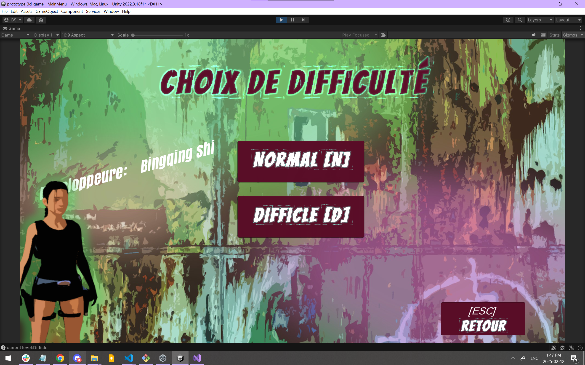
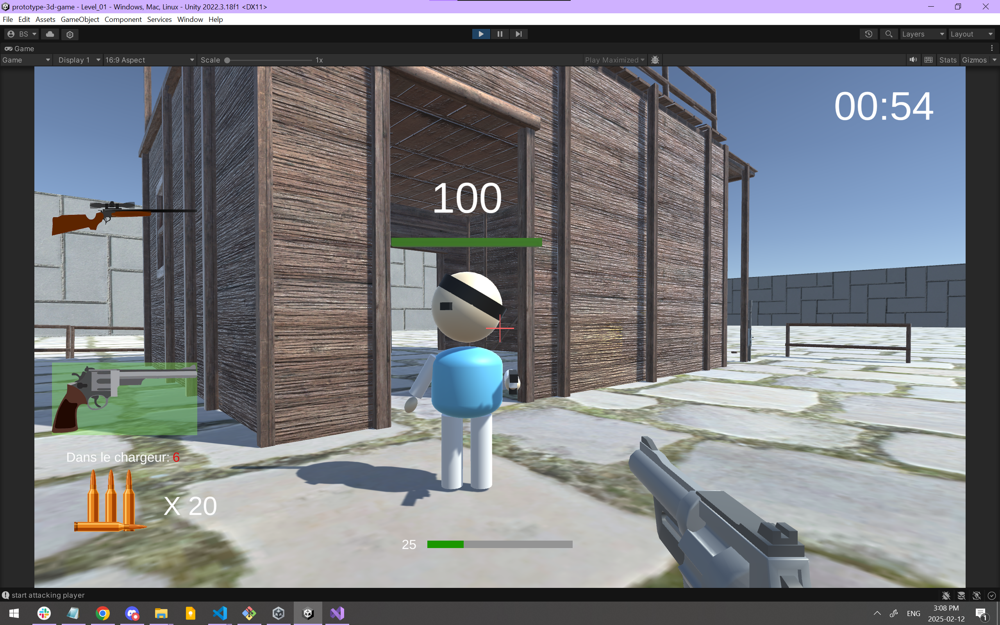
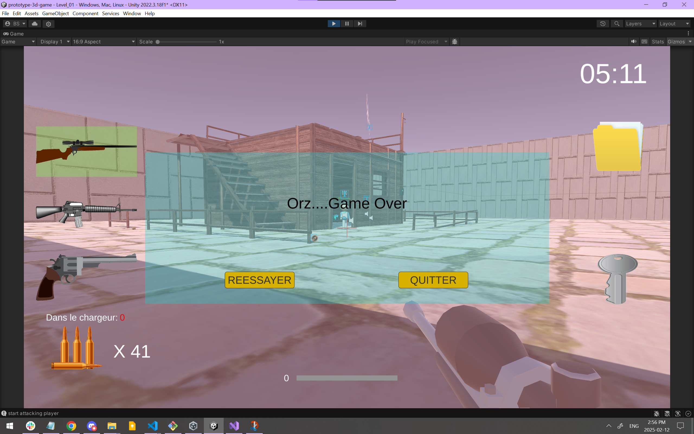

# prototype-3d-game
Design and production of a 3D action game where the player must escape from confined spaces by finding objects and fighting enemies using various weapons.

## Technologies: ##
*** C# · Unity · Visual Studio · Object-Oriented Programming (OOP) ***
Use of the Unity game engine to design the 3D environment, integrate graphic and sound assets via the Asset Store, and program the gameplay mechanics.

## Object-oriented programming ##
Design of dynamic features, such as difficulty levels, real-time interactions, and immersive visual and sound effects.

## Game screenshot ##

Menu: 

Game Scene

